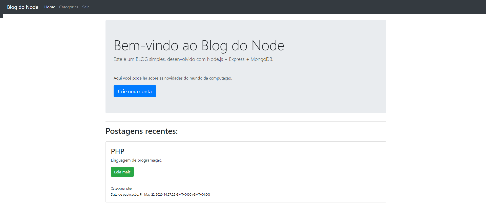

# BlogApp

  

## :rocket: Tecnologias

Esse projeto foi desenvolvido com as seguintes tecnologias:

- JavaScript
- Node.js
= Express
- MongoDB

## 💻 Projeto

É um blog com funcionalidades de criar, editar e deletar postagens. Tendo um sistema de cadastro, login e logout de usuários.
